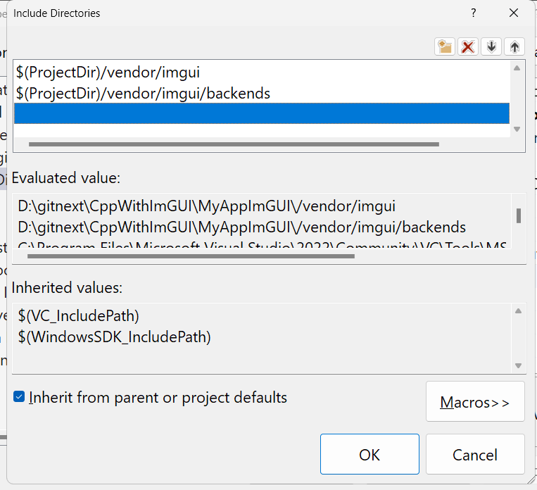
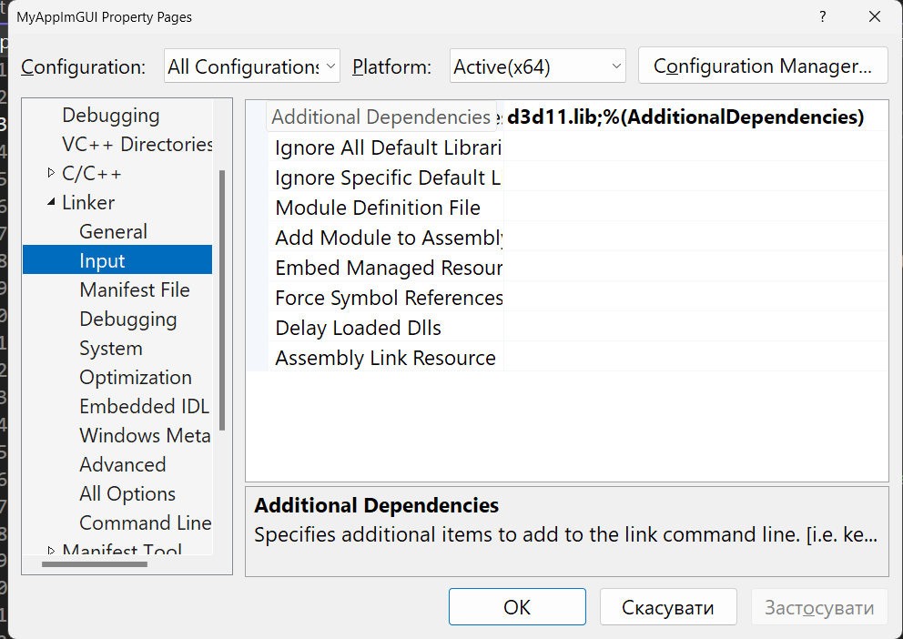

# Desktop application with ImGUI library


This repository contains a basic application framework using [Dear ImGui](https://github.com/ocornut/imgui) for creating graphical user interfaces in C++.

## Features

- Basic ImGui setup and rendering
- Cross-platform support
- Simple application framework to build on

## Getting Started

### Prerequisites

To build and run this project, you need the following installed:

- C++ compiler (GCC, Clang, or MSVC)
- Git

### Cloning the Repository

Clone the repository using the following command:

```bash
git clone https://github.com/IOleg-crypto/imgui_application.git
cd imgui_application
```

!Don't forget to include files on **Visual Studio 2019/2022** (if you face problems)







This project is licensed under the MIT License - see the LICENSE file for details.

For a step-by-step tutorial on setting up and using this project, please refer to the YouTube playlist.


[](https://www.youtube.com/playlist?list=PLTykcSMzD4j8O48ZtfciC9ShZnEvvyNvI)

<<<<<<< HEAD


Feel free to make any additional changes as needed!
=======
Feel free to make any additional changes as needed!
>>>>>>> 0902cdd5bd0d3f081001ae5ed840dcb804eed2a5
